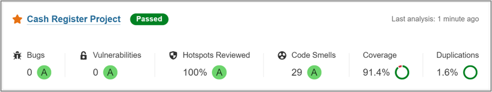

# Cash Register Project

## Project Description

<div>
  <div>
    
  </div>
  <div>
    This project is made for <b>32bit's Backend Competition 2024</b>. The cash register project is designed to facilitate the process of a <b>cashier handling sales transactions</b>.
  </div>
</div>

<br>

## Project Architecture


<br>

## Table of Contents

- [Technologies Used](#technologies-used)
- [Features](#features)
- [Getting Started](#getting-started)
- [Services](#services)
- [Default Ports](#default-ports)
- [Roles & Users](#roles--users)
- [Authentication & Authorization](#authentication--authorization)
- [Endpoints](#endpoints)
- [Request Body Examples](#request-body-examples)
- [Receipt Example](#receipt-example)
- [AI Insight Example](#ai-insight-example)
- [ELK Stack Example](#elk-stack-example)
- [Importing Dashboard Samples to Kibana](#importing-dashboard-samples-to-kibana)
- [SonarQube Result](#sonarqube-result)
- [Using SonarQube for Code Quality Analysis](#using-sonarqube-for-code-quality-analysis)
- [Contact](#contact)

<br>

## Technologies Used

<table>
  <tr>
    <td>
        <ul>
          <li>Java 17</li>
          <li>Spring Boot</li>
          <li>Spring Security</li>
          <li>PostgreSQL</li>
          <li>Java JWT</li>
          <li>Docker</li>
          <li>Google Jib</li>
          <li>Spring Cloud</li>
          <li>Netflix Eureka</li>
          <li>Mockito</li>
          <li>JUnit 5</li>
          <li>JUnit Suite Engine</li>
          <li>JaCoCo</li>
          <li>NGINX</li>
        </ul>
    </td>
    <td>
        <ul>
          <li>Log4j2</li>
          <li>Elasticsearch</li>
          <li>Logstash</li>
          <li>Kibana</li>
          <li>Micrometer</li>
          <li>Zipkin</li>
          <li>Resilience4J</li>
          <li>Redis</li>
          <li>RabbitMQ</li>
          <li>JavaMailSender</li>
          <li>iTextPDF</li>
          <li>JFreeChart</li>
          <li>Google Gemini</li>
          <li>SonarQube</li>
        </ul>
    </td>
  </tr>
</table>

<br>

## Features

<table>
  <tr>
    <td>
        <ul>
          <li>Token & Role Based Authentication & Authorization</li>
          <li>Microservices</li>
          <li>API Gateway</li>
          <li>Load Balancing</li>
          <li>Token Storing</li>
          <li>Caching</li>
          <li>Message Queueing</li>
          <li>Asynchronous Messaging</li>
          <li>Circuit Breaking</li>
          <li>Centralized Logging</li>
          <li>Reverse Proxy</li>
        </ul>
    </td>
    <td>
        <ul>
          <li>Data Visualization</li>
          <li>Distributed Tracing System</li>
          <li>Soft Deletion</li>
          <li>Pagination, Filtering & Sorting</li>
          <li>Unit Testing</li>
          <li>JavaDoc</li>
          <li>Email Sending (when a product is out of stock)</li>
          <li>Receipt Generation</li>
          <li>Chart Generation</li>
          <li>AI Insight</li>
          <li>Static Code Analysis</li>
        </ul>
    </td>
  </tr>
</table>

<br>

## Getting Started

### Prerequisites

Ensure you have the following installed:

- Java 17
- Maven
- Docker

### Usage

Create a `.env` file in the root directory of the project and add the following configuration:

```env
# PORTS
ELASTICSEARCH_PORT=9200
LOGSTASH_PORT=5000
LOGSTASH_HEALTH_CHECK_PORT=9600
KIBANA_PORT=5601
REDIS_PORT=6380
RABBITMQ_PORT=5672
ZIPKIN_PORT=9411
POSTGRES_AUTH_PORT=5433
POSTGRES_USER_PORT=5434
POSTGRES_PRODUCT_PORT=5435
POSTGRES_SALE_PORT=5436
POSTGRES_SONARQUBE_PORT=5437
SONARQUBE_PORT=9000
SERVICE_REGISTRY_PORT=8761
API_GATEWAY_PORT=8080
NGINX_PORT=80

# API KEY
GEMINI_ACTIVE=true           # Make it "false" if you don't want application to use Gemini and provide AI insights
GEMINI_API_KEY=<YOUR_GEMINI_API_KEY>

# EMAIL
SEND_EMAIL=true              # Make it "false" if you don't want application to send Out of Stock Emails
EMAIL_USERNAME=<YOUR_SENDER_EMAIL_ADDRESS>
EMAIL_PASSWORD=<YOUR_SENDER_EMAIL_APP_PASSWORD>
EMAIL_RECIPIENT=<YOUR_RECIPIENT_EMAIL_ADDRESS>
```

To **start** all services defined in docker-compose.yml, use the following command:

```bash
docker-compose up -d
```

To **stop** all running services, use:

```bash
docker-compose down
```

<br>

## Services

### Service Registry

Service Registry acts as a **central directory** for all the microservices in the application. It maintains a list of
available services and their instances, allowing for service discovery. When a service starts, it **registers** itself
with the Service Registry, and other services can query the registry to find the network location of service instances.

### API Gateway

The API Gateway is the entry point for all client requests. It **routes** requests to the appropriate backend services
and performs functions such as **load balancing** and rate limiting. Crucially, the API Gateway also handles **authorization** by verifying the JWT in the Authorization header of incoming requests to ensure they are **valid** and
that the user has the **necessary roles**.

### Auth Service

Auth Service is responsible for managing **authentication**. It handles user **login, logout, registration**, and **token & refresh-token generation**. When users log in, the service verifies their credentials and issues a **JWT** for
authenticated users, which is then used to access protected endpoints through the API Gateway.

### User Service

User Service manages **user-related** operations, including creating, updating, retrieving, and deleting user accounts.
It handles **user data** and ensures that user information is securely stored and accessible to other services that
require
user details.

### Product Service

Product Service manages **product-related** operations. It handles the creation, update, retrieval, and deletion of
products. This service is responsible for maintaining **product information**, such as product names, descriptions,
prices,
and stock levels.

### Sale Service

Sale Service is responsible for handling **sales transactions** and **managing campaigns**. It allows for the creation,
retrieval, and management of sales records. The service supports **five types of payment methods**: cash, credit card,
mixed, debit card, and PayPal.
> **⚠️ Note:** The **MIXED** payment method consists of a **combination** of **cash** and **credit card** payments.

### Report Service

Report Service is responsible for **generating receipts** related to sales and transactions. It allows users to **view
detailed sales information** and generate receipts for completed transactions. This service provides **AI insights**
into sales
performance, helping businesses make informed decisions based on sales data.

<br>

## Default Ports

Any changes to these ports require changes to the configuration files.

| Container          | Port       |
|--------------------|------------|
| NGINX              | 80         | 
| API Gateway        | 8080       | 
| Service Registry   | 8761       | 
| Redis              | 6380       | 
| RabbitMQ           | 5672       | 
| Zipkin             | 9411       | 
| Postgres-Auth      | 5433       |
| Postgres-User      | 5434       |
| Postgres-Product   | 5435       |
| Postgres-Sale      | 5436       |
| Postgres-SonarQube | 5437       |
| SonarQube          | 9000       |
| Elasticsearch      | 9200       |
| Logstash           | 5000, 9600 |
| Kibana             | 5601       |

<br>

## Roles & Users

### Default Roles

> There are three default roles in the system:
> - CASHIER
> - MANAGER
> - ADMIN

To make requests to the relevant service, you need to have the following role.

| Service         | Role    |
|-----------------|---------|
| Auth Service    |         | 
| User Service    | ADMIN   | 
| Product Service |         | 
| Sale Service    | CASHIER | 
| Report Service  | MANAGER | 

### Default Users

To make requests to the relevant service, you need to have the following role.

| User         | Username | Password | Roles                   |
|--------------|----------|----------|-------------------------|
| SUPER User   | super    | super    | CASHIER, MANAGER, ADMIN |
| CASHIER User | cashier  | cashier  | CASHIER                 |
| MANAGER User | manager  | manager  | MANAGER                 |
| ADMIN User   | admin    | admin    | ADMIN                   |

<br>

## Authentication & Authorization

> **⚠️Important:** All endpoints require a **JSON Web Token (JWT)** for authentication except auth/login, so **you need
to log in first**.
> To access the endpoints, include the JWT in the Authorization header of your HTTP requests as a **Bearer token**.

An example of login request:

```json
{
  "username": "super",
  "password": "super"
}
```

<br>

## Endpoints

All requests should be made to the **API Gateway's URL** which is **http://localhost**. The url does **not include the
port number**.

- **URL Example** `http://localhost/auth/login`

### Auth Service

| HTTP Method | Endpoint      | Description                        |
|-------------|---------------|------------------------------------|
| GET         | /auth/refresh | Refresh JWT                        | 
| POST        | /auth/login   | Authenticate user and generate JWT |
| POST        | /auth/logout  | logout and terminate JWT           | 

### User Service

| HTTP Method | Endpoint                 | Description                            |
|-------------|--------------------------|----------------------------------------|
| GET         | /users/{id}              | Get user by ID                         |
| GET         | /users                   | Get all users                          |
| GET         | /users/deleted           | Get all deleted users                  |
| GET         | /users/filteredAndSorted | Get all users with filters and sorting |
| POST        | /users                   | Create a new user                      |
| PUT         | /users/{id}              | Update user by ID                      |
| PUT         | /users/restore/{id}      | Restore soft deleted user              |
| DELETE      | /users/{id}              | Soft delete user by ID                 |
| DELETE      | /users/permanent/{id}    | Permanently delete user by ID          |

### Product Service

| HTTP Method | Endpoint                    | Description                               |
|-------------|-----------------------------|-------------------------------------------|
| GET         | /products/{id}              | Get product by ID                         |
| GET         | /products                   | Get all products                          |
| GET         | /products/deleted           | Get all deleted products                  |
| GET         | /products/filteredAndSorted | Get all products with filters and sorting |
| POST        | /products                   | Create a new product                      |
| PUT         | /products/{id}              | Update product by ID                      |
| PUT         | /products/restore/{id}      | Restore soft deleted product              |
| DELETE      | /products/{id}              | Soft delete product by ID                 |
| DELETE      | /products/permanent/{id}    | Permanently delete product by ID          |

### Sale Service

| HTTP Method | Endpoint                     | Description                                |
|-------------|------------------------------|--------------------------------------------|
| GET         | /campaigns/{id}              | Get campaign by ID                         |
| GET         | /campaigns                   | Get all campaigns                          |
| GET         | /campaigns/filteredAndSorted | Get all campaigns with filters and sorting |
| POST        | /sales                       | Create a new sale                          |
| PUT         | /sales/{id}                  | Update sale by ID                          |
| PUT         | /sales/cancel/{id}           | Cancel sale by ID                          |
| PUT         | /sales/restore/{id}          | Restore sale by ID                         |
| DELETE      | /sales/{id}                  | Soft delete sale by ID                     |
| DELETE      | /sales/permanent/{id}        | Permanently delete sale by ID              |

### Report Service

| HTTP Method | Endpoint                   | Description                            |
|-------------|----------------------------|----------------------------------------|
| GET         | /reports/{id}              | Get sale by ID                         |
| GET         | /reports                   | Get all sales                          |
| GET         | /reports/deleted           | Get all deleted sales                  |
| GET         | /reports/filteredAndSorted | Get all sales with filters and sorting |
| GET         | /reports/receipt/{id}      | Get receipt by sale ID                 |

<br>

## Request Body Examples

### Auth Service

**Endpoint:**

- **POST** `/auth/login`

```json
{
  "username": "super",
  "password": "super"
}
```

### User Service

**Endpoints:**

- **POST** `/users`
- **PUT** `/users/{id}`

```json
{
  "name": "John Doe",
  "username": "johndoe",
  "email": "johndoe@gmail.com",
  "password": "johndoe54",
  "roles": [
    "ADMIN",
    "CASHIER"
  ]
}
```

### Product Service

**Endpoints:**

- **POST** `/products`
- **PUT** `/products/{id}`

```json
{
  "name": "product",
  "description": "a product",
  "stockQuantity": "20",
  "price": 150
}
```

### Sale Service

**Endpoints:**

- **POST** `/sales`
- **PUT** `/sales/{id}`

```json
{
  "cashier": "Jack",
  "paymentMethod": "mixed",
  "campaignIds": [
    2,
    3
  ],
  "products": [
    {
      "id": 12,
      "quantity": 2
    },
    {
      "id": 10,
      "quantity": 1
    }
  ],
  "cash": null,
  "mixedPayment": {
    "cashAmount": 1500.00,
    "creditCardAmount": 1200.00
  }
}
```

> **⚠️ Note:** Since there are **5 types of payment methods**, this JSON object can vary. Below is also valid.

```json
{
  "cashier": "Jack",
  "paymentMethod": "cash",
  "campaignIds": [
    2,
    3
  ],
  "products": [
    {
      "id": 12,
      "quantity": 2
    },
    {
      "id": 10,
      "quantity": 1
    }
  ],
  "cash": 2500,
  "mixedPayment": null
}
```

<br>

## Receipt Example


<br>

## AI Insight Example


<br>

## ELK Stack Example


<br>

## Importing Dashboard Samples to Kibana

As the owner of the project, I prepared 4 dashboards for you.
You can import it by following the steps below.

### 1. Go to Kibana

Open the Kibana instance in a web browser by going to **http://localhost:5601** url.

### 2. Navigate to Saved Objects

Go to `Stack Management` from the main menu.
Click on `Saved Objects`.

### 3. Import the Dashboards

Click the `Import` button. Select the dashboard sample in `~kibana_dashboards` directory.

<br>

## SonarQube Result



<br>

## Using SonarQube for Code Quality Analysis

### 1. Start SonarQube with Docker Compose

First, **run the following command** to start SonarQube:

```bash
docker compose -f docker-compose.sonarqube.yml up -d
```

### 2. Generate a Token in SonarQube

Open your browser and navigate to **http://localhost:9000**.
Log in with the **default credentials (admin/admin)**.
Go to `My Account > Security`.
Generate a new **token** and copy it

### 3. Configure sonar-project.properties

In your project's root directory, open the **sonar-project.properties** file and **add the token** as the value
of `sonar.login` property.

### 4. Run SonarQube Analysis

Finally, **run the following command** to perform the SonarQube analysis:

```bash
./mvnw clean verify -Psonar sonar:sonar
```

<br>

---

## Contact

If you have any questions or feedback about this project, feel free to reach out to me!

- **Name**: Emirhan Tuygun
- **Email**: emiirhantuygun@gmail.com

You can also open an issue or a pull request if you find any bugs or want to contribute to the project.


